# MATCH THE PICTURES

This website is designed to provide a fun, simple and well-balanced user experience. The game premise is a simple, well-known, recognisable picture matching game. The users are timed and pitted against other players on the scoreboard. The changeable game levels allow users to increase the difficult and improve their game performance.

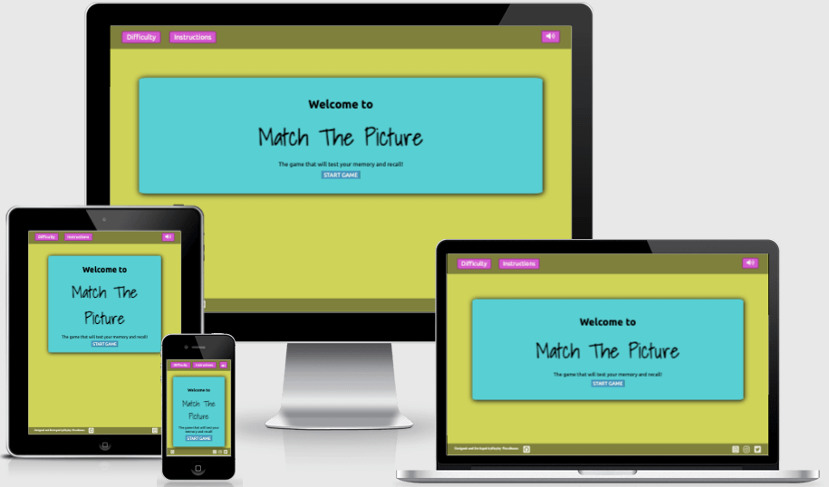

Play match the picture [here](https://hayley-woodhouse.github.io/milestone-2-project/)
# Contents
* [1 UX Design](#1-ux-design)
    * [1.1 User Stories](#11-user-stories)
* [2 Strategy](#2-strategy)
    * [2.1 Developers Project](#21-developers-project)
    * [2.2 Business](#22-business)
    * [2.3 Users](#23-users)
* [3 Scope](#3-scope)
    * [3.1 Features](#31-features)
    * [3.1 Future Updates](#32-future-updates)
* [4 Structure](#4-structure)
    * [4.1 Initial Page structure](#41-initial-page-structure)
* [5 Skeleton](#5-skeleton)
    * [5.1 Wireframes](#51-wireframes)
        * [5.1.1 Opening Page](#511-opening-page)
        * [5.1.2 Layout](#512-layout)
        * [5.1.3 Instructions](#513-instructions)
        * [5.1.4 Score Board](#514-score-board)
        * [5.1.5 Settings](#515-settings)
        * [5.1.6 Game completion](#516-game-completion)
        * [5.1.7 Colours](#517-colours)
* [6 Surface](#6-surface)
    * [6.1 Visual Design](#61-visual-design)
        * [6.1.1 Colour](#611-colours)
        * [6.1.2 Typography](#612-typography)
        * [6.1.3 Images](#613-images)
* [7 Complete Game](#7-complete-game)
* [8 Testing](#8-testing)
* [9 Technologies used](#9-technologies-used)
* [10 Credits](#10-credits)
* [Acknowledgements](#11-acknowledgements)

# 1 UX Design

## 1.1 User Stories

### Gamer’s user stories 
As a user I want to …

1.  Have easy access and a clear understanding of the game.
2.	Be able to record and review my scores and compare them against other users.
3.	Have a difficultly leave to better my gaming performance.
4.	The game to be available on all devices so that the game can be played on the bus/train/waiting room etc.
5.	Simple design that is easily readable and not overwhelming.
6.	Clear and concise rules of the game.
7.	I don’t want a scrolling screen as this makes usability difficult and directly impacts the gaming performance.

### Business’ user stories
As a business we want to…

1.	Have the brand logo clearly visible across the site.
2. 	Have access available for users to access social media platforms
3.	Have a fun and interactive layout that encourages repeat users.
4.	Have access available on all devices.

### Developers’ user stories
As a web developer I want to…

1.	Provide a great interactive experience for the users.
2.	Have a simple readable HTML, CSS and JavaScript files that are easily readable for    updates and fixes.
3.	Provide a well written format for the descriptive functions of the game.
4.	Have good database indexes that enable the game to run as fast as possible.
5.	Have a great site that complies with the W3C guidelines.
6.	Provide a great responsive site that is available across multiple devices and sizes.

[Back to top](#contents)

# 2 Strategy

## 2.1 Developers Project 
The aim for this project is to produce a full functional picture matching game that has three options for difficulty level (easy, medium, and hard). The game will be positioned on a static screen that is available on multiple varied screens and devices. The game will have a set of clear instructions and a score board with results for players. The games design will be simple, and the page will be easy to navigate.

[Back to top](#contents)

## 2.2 Business
The aim is to provide a clear game logo with links to the business social media pages.

[Back to top](#contents)

## 2.3 Users 
The aim is to give users a simple game platform with easily assessable instructions / changeable difficulty levels / score board / links to social media sites / an optional feedback form for viewers to give games reviews and reports possible bugs or development suggestions.

[Back to top](#contents)

# 3 Scope

## 3.1 Features

This list of objectives is designed achieve a well-balanced website that meets the needs and requirements of the business and users’ strategy outcomes. Within the designated time scale the following criteria will be introduced to the website on initial release.

- Login option to record scores.
- Level setting (easy, medium, and hard)
- Instructions for the game and keypad operations
- Game layout
- Time - for speed for record of score
- Scoreboard
- Social media and game logo
- A static webpage with pop outs for scores, level settings, and instructions.
- Game settings for changing sounds.

[Back to top](#contents)

## 3.2 Future Updates 
- a feedback contact form. 

As contact is possible through social media this will be added at a later update considering the time frame for the first design release.

[Back to top](#contents)

# 4 Structure

The features acknowledged from the scope plane will be implemented into the following structure of the website. 

[Back to top](#contents)

## 4.1 Initial Page structure

- The website’s navigation will consist of an initial pop up with the option of the user inputting a username. This will enable the game scores for that user to be recorded the scoreboard. A skip option will be available for this pop up, and the scoreboard will record the username and unknown.

- The page beneath the pop up will be a match picture game set to a default difficult level of easy. 

- The layout will have a navbar at the top of the page with a dropdown menu for selecting the difficulty level, and the instructions to the game, gamers scores and the settings symbol to adjust volume settings.  

- The game structure will centre the page and a timer above the game that will begin at the click of the first card. 

- The footer will consist of the social media links to the business accounts and a website developers’ information with a clickable link to their business page.

- On completion a game a pop-up will appear with a congratulatory message, the users name and the game time score.

- The business logo will be added to the back of the cards for the game and will change colour depending on the level setting. 

[Back to top](#contents)

# 5 Skeleton

## 5.1 Wireframes

The wireframes for the website was created using [Balsamiq Wireframes]( https://balsamiq.com/). Using the structure plane the following mock-ups were generated.  

[Back to top](#contents)

### 5.1.1 Opening Page

The opening popout window will wlcome users to the game. The user then moves on a input where the user can enters a name into the field, then this will be referred to when the results of the played game are added to the score board. If the user skip the name field, then the score board will register the username “name”.

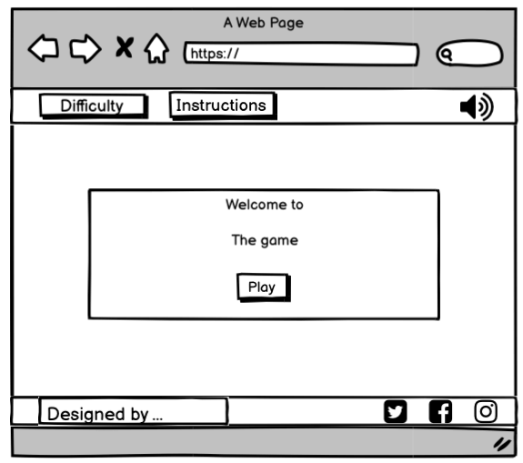\
*compressed from 58.8 KB to 20.0 KB via [TinyPNG](https://tinypng.com/)*

[Back to top](#contents)

### 5.1.2 Layout

When the opening page pop-up has be completed the user will be presented with the simple screen layout. A default game set at difficulty ‘easy’ will be ready to start. A timer will record the length of play. 

### Navbar

The nav bar will have four options 
1 difficulty level
2 instructions 
3 sound control 

Difficulty level can be change via a dropdown menu with three options. Easy, medium, and hard. 

The sounds will be able to be switch off on click of the sound icon

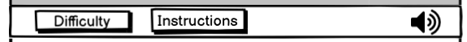\
*compressed from 16.9 KB to 4.8 KB via [TinyPNG](https://tinypng.com/)*

### Game Layout

The difficulty level will determine how many cards are to be played. 

The easy level will deal 12 cards for the player to match 6 pictures.

The medium level will deal 16 cards for 8 matches.

The hard level will deal 24 cards for 12 matches

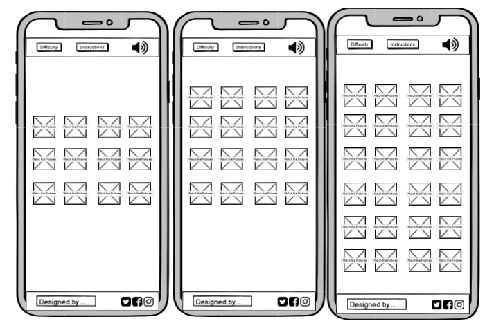\
*compressed from 143.5 KB to 47.3 KB via [TinyPNG](https://tinypng.com/)*

### Footer

The footer comprises of three social media links. Twitter, Facebook, and Instagram. The web designer name with a link to their details.

\
*compressed from 17.1 KB to 4.5 KB via [TinyPNG](https://tinypng.com/)*

[Back to top](#contents)

### 5.1.3 Instructions

On click a pop-out will appear and fill the screen. The information will give context as to the operation of the game, how to change settings, difficulty and to check scores. 

\
*compressed from 81.3 KB to 29.5 KB via [TinyPNG](https://tinypng.com/)*

[Back to top](#contents)

### 5.1.4 Score Board

On click a pop-out will appear and fill the screen. The users game results will be logged to the score board. 

[Back to top](#contents)

### 5.1.5 Settings

On click a pop-out will appear and fill the screen. The on/off switches will be operated by click. These control the sound settings.

### 5.1.6 Game completion

When a game is completed a pop-out window will appear. The message will congratulate the user on their game and show the level they accomplished and the time they did it in.

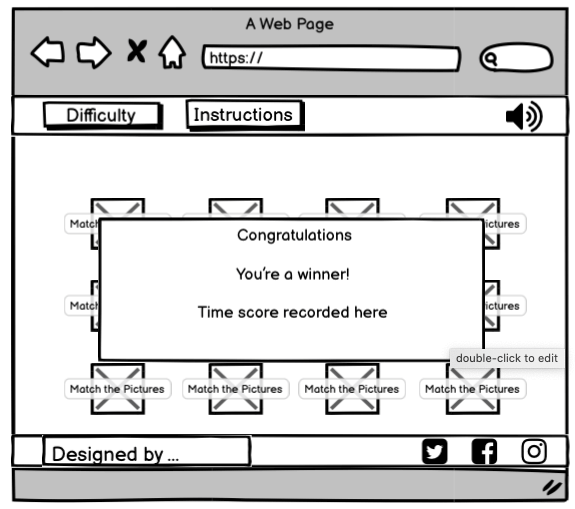\
*compressed from 50.0 KB to 16.3 KB via [TinyPNG](https://tinypng.com/)*

[Back to top](#contents)

# 6 Surface 

## 6.1 Visual Design

The visual design used within the website covers the colour, font type, effects, and images. It guides the user through the content and provides well-presented information.

### 6.1.1 Colours

The colours seleted for the website were choosen using [Tools Pic Art](https://tools.picsart.com/color/wheel/). These are,

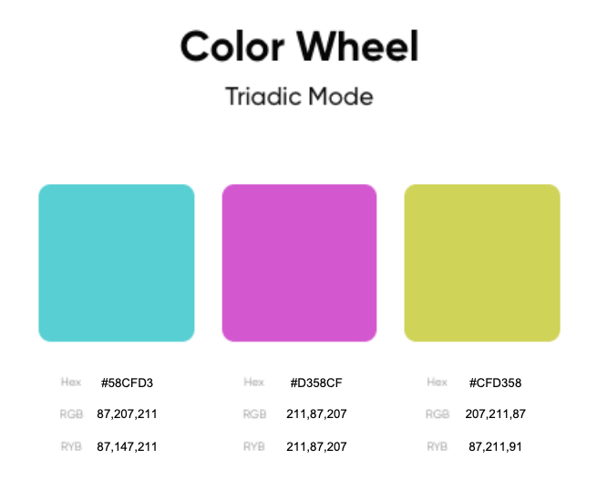
*compressed from 39.8 KB to 12.6 KB via [TinyPNG](https://tinypng.com/)*

## 6.1.2 Typography

The font type used throughout the website is,

Ubuntu - light 300 regular 400 medium 500 bold

from [Google Fonts](https://fonts.google.com/)

*compressed from 97.4 KB to 27.9 KB via [TinyPNG](https://tinypng.com/)*

## 6.1.3 Images

The game will randomly select from a file of 25 images.
These images can be viewed [here](IMAGES.md).

### Game Card Image
---
The game layout will comprise of a set of images that will increases in number depending on the level of difficulty. 

The easy level will have a set of 6 duplicated images, 12 in total. 

The meduim level will have a set of 8 duplicated images, 16 in total.

The hard level will have a set of 10 duplicated images, 20 in total.

The overlaying image will have the business logo 

Image design

 
The game card was created using [Pixlr](https://pixlr.com/) and the image design was as follows.

Text “match” and “pictures”
-	Font - Baileyns
-	Colour - #191914

Text “the”
-	Font – Sweeneey
-	Colour – gardient #D358CF and #CFD358

Background
-	Colour - #58CFD3
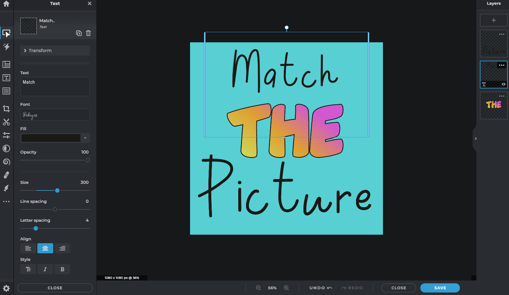
*compressed from 184.4 KB to 45.7 KB via [TinyPNG](https://tinypng.com/)*

 

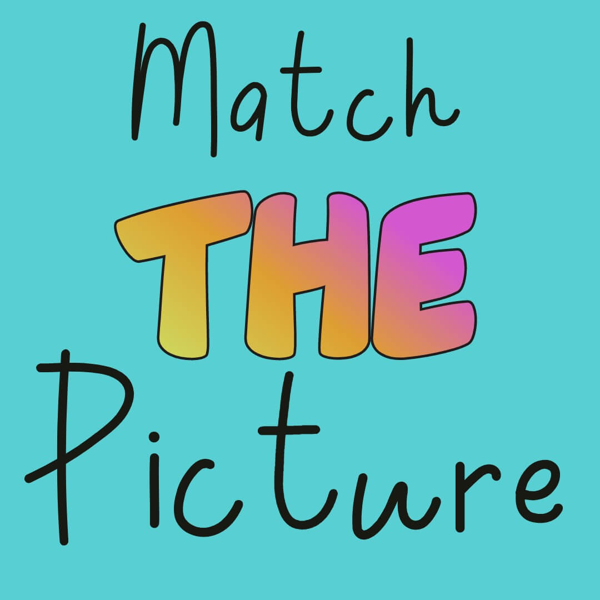
*compressed from 82.4 KB to 52.9 KB via [TinyPNG](https://tinypng.com/)*

# 7 Complete Game

The Games opening page has a pop up window, that guides users to the start button that on click removes the welcome window and displays a input field.

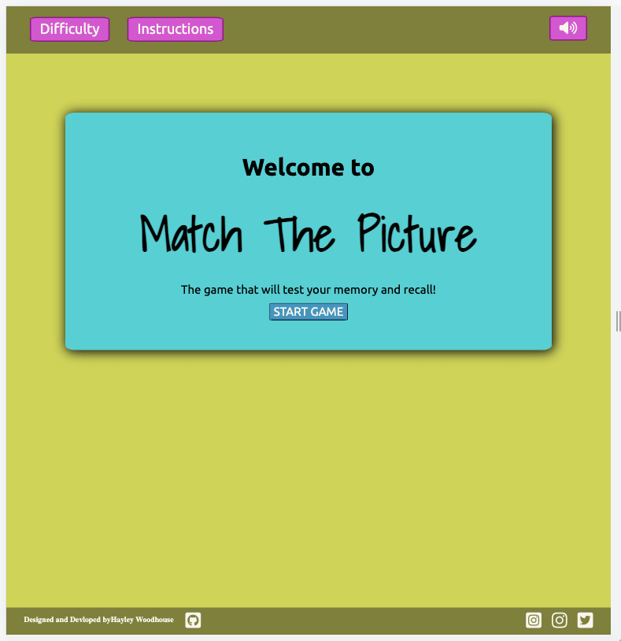
*compressed from 60.0 KB to 15.8 KB via [TinyPNG](https://tinypng.com/)*

The input field allows users to input their name. This will be displayed in the game scores section If a name is not enter the default value 'name' will be inputted. They can also select a game level.

*compressed from 38.1 KB to 8.6 KB via [TinyPNG](https://tinypng.com/)*

[Back to top](#contents)

Once a level is selected the cards, which are set to randomly shuffle, will appear onscreen.
At any point within the game the user can change the difficulty by using the top difficulty button to render a new game. At the bottom of the game a matched total will appear to display the users progress throught the game.

Easy set

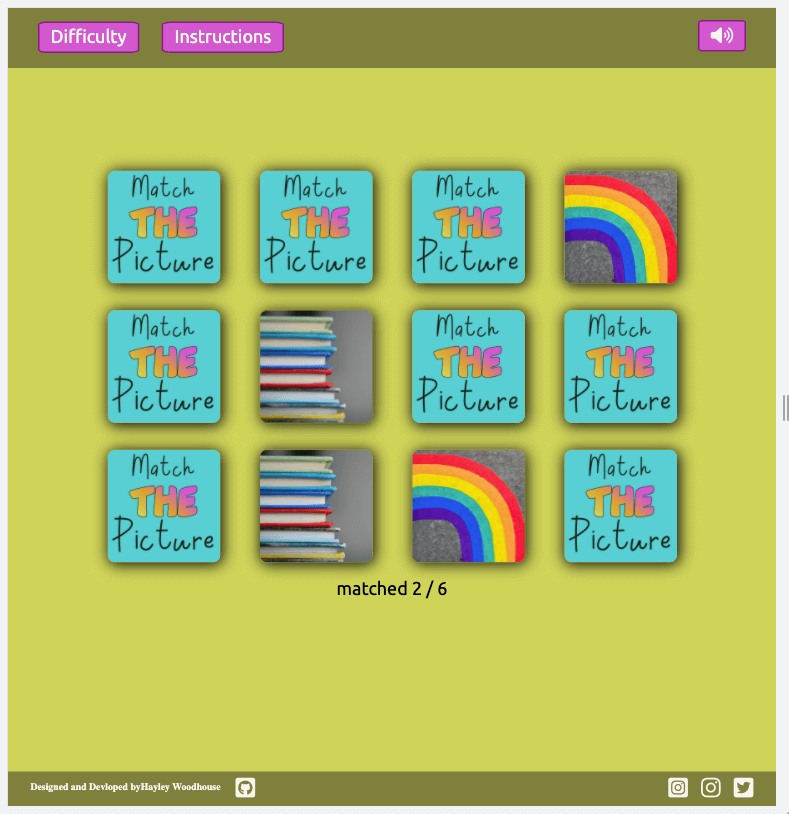
*compressed from 280.5 KB to 58.7 KB via [TinyPNG](https://tinypng.com/)*

Medium set

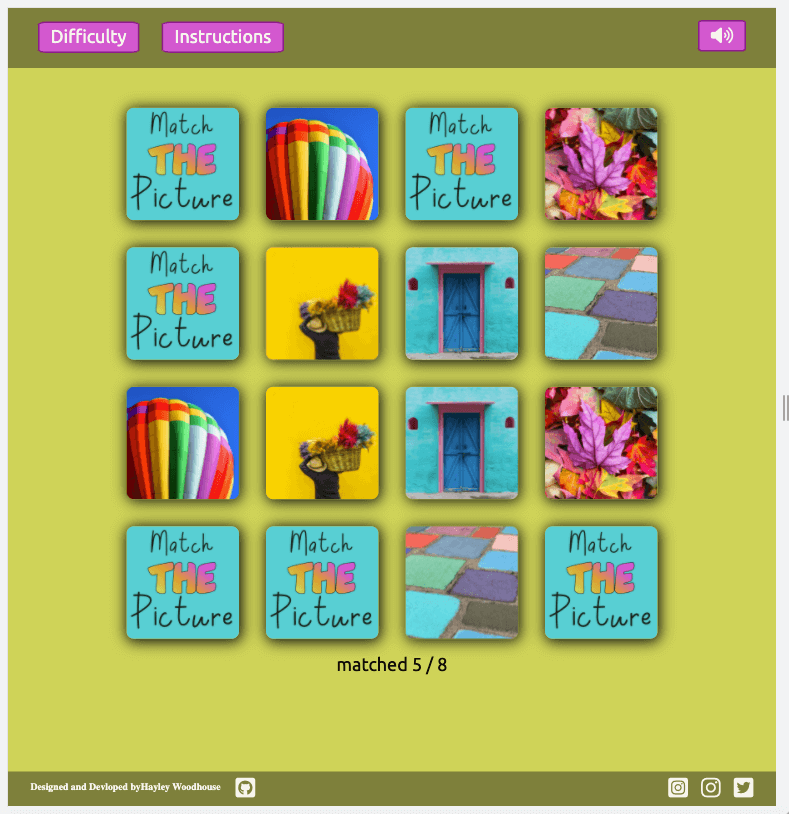
*compressed from 415.7 KB to 75.7 KB via [TinyPNG](https://tinypng.com/)*

Hard set

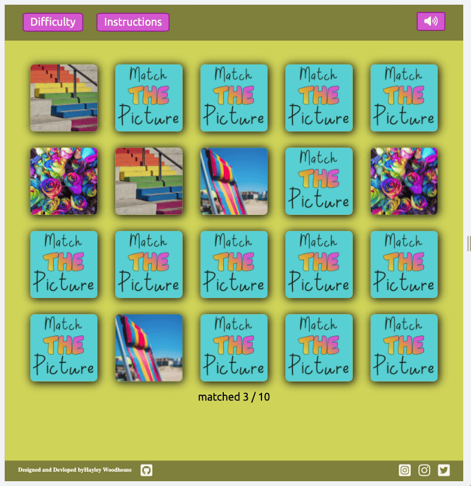
*compressed from 365.6 KB to 74.8 KB via [TinyPNG](https://tinypng.com/)*

[Back to top](#contents)

When the game is complete the congratulations message window will appear. It will input the username the level the game was played and the time the play took to complete the game.

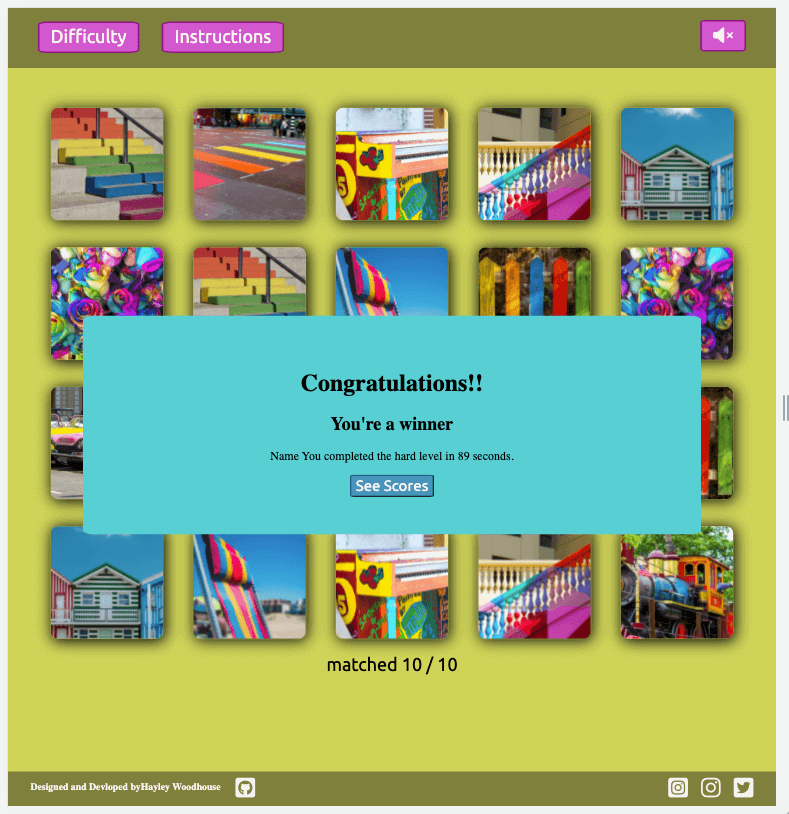
*compressed from 497.4 KB to 98.0 KB via [TinyPNG](https://tinypng.com/)*

[Back to top](#contents)

When the user clicks the See Score they can view their game score.

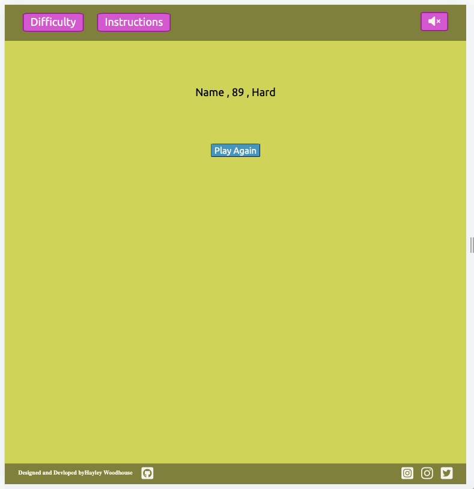
*compressed from 33.9 KB to 7.7 KB via [TinyPNG](https://tinypng.com/)*

[Back to top](#contents)

The 'Play Again' button resets the game back to the beginning. 

The instructions button produces a pop-out window that provides the user with a discription as to how to play the game.

The sounds can be turned off onclick of the icon in the top right corner.

The sounds used where from [Audio micro](https://www.audiomicro.com/).
- trolley bell 4 when a match is made.
- Fireworks, rocket whistle for the congratulation window.

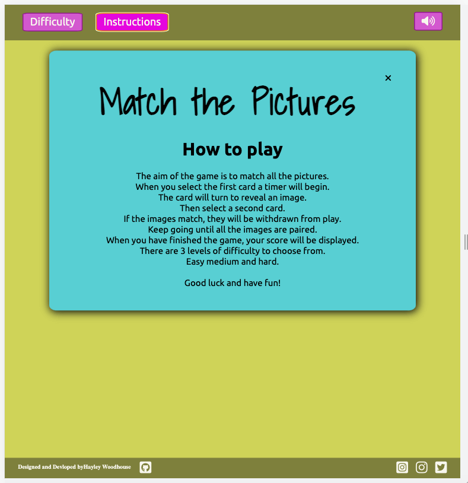
*compressed from 103.4 KB to 24.0 KB via [TinyPNG](https://tinypng.com/)*

[Back to top](#contents)

# 8 Testing

Click the [link](TESTING.md) for testing.

[Back to top](#contents)

# 9 Technologies used
- [HTML 5](https://en.wikipedia.org/wiki/HTML5) 
- [CSS](https://en.wikipedia.org/wiki/CSS)
- [JS](https://en.wikipedia.org/wiki/JavaScript)
- [Balsamiq](https://balsamiq.com/wireframes/desktop/#)
- [gitpod](https://www.gitpod.io/)
- [github](https://github.com/Hayley-Woodhouse/Milestone-1-project)
- [W3 Schools](https://www.w3schools.com/)
- [MND web docs](https://developer.mozilla.org/en-US/docs/Web/JavaScript)

[Back to top](#contents)

# 10 Credits

- [Font awesome](https://fontawesome.com/) was used for all icons.
- [Google fonts](https://fonts.google.com/) was used for the fonts within the website.
- [Pixlr](https://pixlr.com/x/#search) For all images used throughout the website.
- [Audio micro](https://www.audiomicro.com/free-sound-effects/free-electronics) was used for the sounds
- [Favicon](https://favicon.io/emoji-favicons/cocktail-glass/) was used for the favicon image.
- [W3S](https://validator.w3.org/) was used to validate the html and css files.

[Back to top](#contents)

# 11 Acknowledgements

This web site was created for the second milestone project for the full stack development diploma with the code instatute and harlow college.

With thanks to 

Precious Ljege for the mentor assistants, advice and support.

Philip Morris for the tuition and guidence.

Richard Woodhouse for support and user testing.

[Back to top](#contents)

