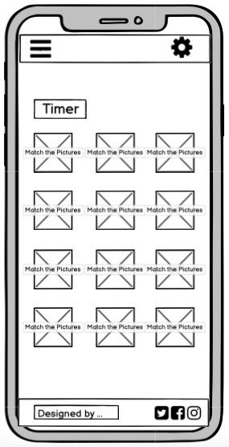
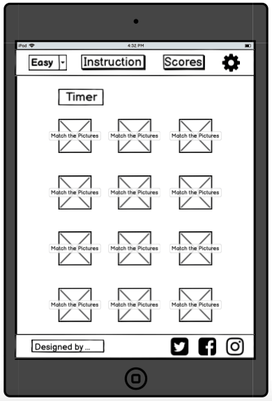
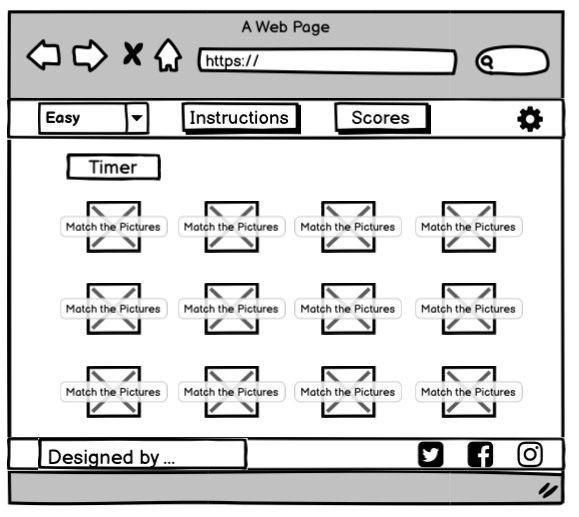

# MATCH THE PICTURES

This website is designed to provide a fun, simple and well-balanced user experience. The game premise is a simple, well-known, recognisable picture matching game. The users are timed and pitted against other players on the scoreboard. The changeable game levels allow users to increase the difficult and improve their game performance.

# Contents
* [1 UX Design](#1-ux-design)
    * [1.1 User Stories](#11-user-stories)
* [2 Strategy](#2-strategy)
    * [2.1 Project](#21-project)
    * [2.2 Business](#22-business)
    * [2.3 Users](#23-users)
* [3 Scope](#3-scope)
    * [3.1 Features](#31-features)
    * [3.1 Future Updates](#32-future-updates)
* [4 Structure](#4-structure)
    * [4.1 Initial Page structure](#41-initial-page-structure)
* [5 Skeleton](#5-skeleton)
    * [5.1 Wireframes](#51-wireframes)
        * [5.1.1 Opening Page](#511-opening-page)
        * [5.1.2 Game Layout](#512-game-layout)
        * [5.1.3 Instructions](#513-instructions)
        * [5.1.4 Score Board](#514-score-board)
        * [5.1.5 Settings](#515-settings)
        * [5.1.6 Game completion](#516-game-completion)

# 1 UX Design

## 1.1 User Stories

-	I want to be able to have easy access and a clear understanding of the game.
-	I want to be able to record and review my scores and compare them against other users.
-	I want to have a difficultly leave to better my gaming performance.
-	I want to the game to be available on all devices so that the game can be played on the bus/train/waiting room etc.
-	I want a simple design that is easily readable and not overwhelming.
-	I want clear and concise rules of the game.
-	I don’t want a scrolling screen as this makes usability difficult and directly impacts the gaming performance.

[Back to top](#contents)

# 2 Strategy

## 2.1 Project 
The aim for this project is to produce a full functional picture matching game that has three options for difficulty level (easy, medium, and hard). The game will be positioned on a static screen that is available on multiple varied screens and devices. The game will have a set of clear instructions and a score board with results for players. The games design will be simple, and the page will be easy to navigate.

[Back to top](#contents)

## 2.2 Business
The aim is to provide a clear game logo with links to the business social media pages.

[Back to top](#contents)

## 2.3 Users 
The aim is to give users a simple game platform with easily assessable instructions / changeable difficulty levels / score board / links to social media sites / an optional feedback form for viewers to give games reviews and reports possible bugs or development suggestions.

[Back to top](#contents)

# 3 Scope

## 3.1 Features

This list of objectives is designed achieve a well-balanced website that meets the needs and requirements of the business and users’ strategy outcomes. Within the designated time scale the following criteria will be introduced to the website on initial release.

- Login option to record scores.
- Level setting (easy, medium, and hard)
- Instructions for the game and keypad operations
- Game layout
- Time - for speed for record of score
- Scoreboard
- Social media and game logo
- A static webpage with pop outs for scores, level settings, and instructions.
- Game settings for removing sounds and vibration options.

[Back to top](#contents)

## 3.2 Future Updates 
- a feedback contact form. 

As contact is possible through social media this will be added at a later update considering the time frame for the first design release.

[Back to top](#contents)

# 4 Structure

The features acknowledged from the scope plane will be implemented into the following structure of the website. 

[Back to top](#contents)

## 4.1 Initial Page structure

- The website’s navigation will consist of an initial pop up with the option of the user inputting a username. This will enable the game scores for that user to be recorded the scoreboard. A skip option will be available for this pop up, and the scoreboard will record the username and unknown.

- The page beneath the pop up will be a match picture game set to a default difficult level of easy. 

- The layout will have a navbar at the top of the page with a dropdown menu for selecting the difficulty level, and the instructions to the game, gamers scores and the settings symbol to adjust volume settings.  

- The game structure will centre the page and a timer above the game that will begin at the click of the first card. 

- The footer will consist of the social media links to the business accounts and a website developers’ information with a clickable link to their business page.

- On completion a game a pop-up will appear with a congratulatory message, the users name and the game time score.

- The business logo will be added to the back of the cards for the game and will change colour depending on the level setting. 

[Back to top](#contents)

# 5 Skeleton

## 5.1 Wireframes

The wireframes for the website was created using [Balsamiq Wireframes]( https://balsamiq.com/). Using the structure plane the following mock-ups were generated.  

[Back to top](#contents)

### 5.1.1 Opening Page

The pop-up user login option will be displayed on the opening page. This has an skip option. The username will be then used to log the users games results to the score board. If the pop-up is skipped the users score board name will be logsed as unknown.

compressed from 51.1 KB to 16.6 KB via [TinyPNG](https://tinypng.com/)

compressed from 48.8 KB to 16.1KB via [TinyPNG](https://tinypng.com/)

compressed from 69.8 KB to 24.4 KB via [TinyPNG](https://tinypng.com/)

[Back to top](#contents)

### 5.1.2 Game Layout

compressed from 70.7 KB to 22.8 KB via [TinyPNG](https://tinypng.com/)

compressed from 68.4 KB to 20.3 KB via [TinyPNG](https://tinypng.com/)

compressed from 100.5 KB to 35.2 KB via [TinyPNG](https://tinypng.com/)

[Back to top](#contents)

### 5.1.3 Instructions

compressed from 68.5 KB to 24.8 KB via [TinyPNG](https://tinypng.com/)

compressed from 67.0 KB to 23.3 KB via [TinyPNG](https://tinypng.com/)

compressed from 81.3 KB to 29.5 KB via [TinyPNG](https://tinypng.com/)

[Back to top](#contents)

### 5.1.4 Score Board

compressed from 42.1 KB to 12.7 KB via [TinyPNG](https://tinypng.com/)

compressed from 40.4 KB to 12.0 KB via [TinyPNG](https://tinypng.com/)

compressed from 61.2 KB to 20.3 KB via [TinyPNG](https://tinypng.com/)

[Back to top](#contents)

### 5.1.5 Settings

compressed from 41.5 KB to 13.1 KB via [TinyPNG](https://tinypng.com/)

compressed from 36.6 KB to 12.3 KB via [TinyPNG](https://tinypng.com/)

compressed from 62.6 KB to 22.4 KB via [TinyPNG](https://tinypng.com/)

[Back to top](#contents)

### 5.1.6 Game completion

compressed from 50.0 KB to 16.3 KB via [TinyPNG](https://tinypng.com/)

compressed from 43.7 KB to 13.9 KB via [TinyPNG](https://tinypng.com/)

compressed from 64.5 KB to 22.1 KB via [TinyPNG](https://tinypng.com/)

[Back to top](#contents)

