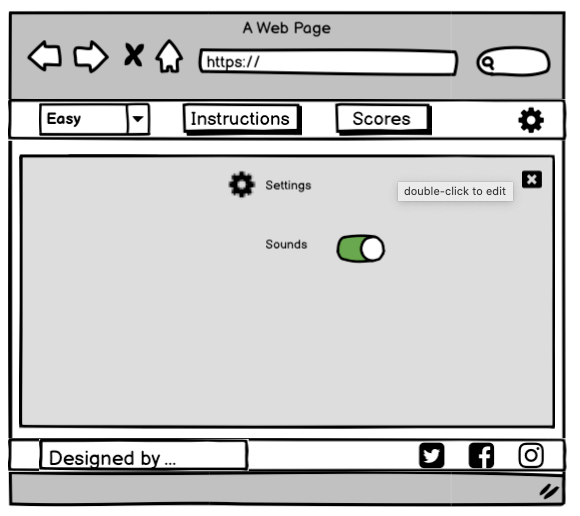

# MATCH THE PICTURES

This website is designed to provide a fun, simple and well-balanced user experience. The game premise is a simple, well-known, recognisable picture matching game. The users are timed and pitted against other players on the scoreboard. The changeable game levels allow users to increase the difficult and improve their game performance.

# Contents
* [1 UX Design](#1-ux-design)
    * [1.1 User Stories](#11-user-stories)
* [2 Strategy](#2-strategy)
    * [2.1 Developers Project](#21-developers-project)
    * [2.2 Business](#22-business)
    * [2.3 Users](#23-users)
* [3 Scope](#3-scope)
    * [3.1 Features](#31-features)
    * [3.1 Future Updates](#32-future-updates)
* [4 Structure](#4-structure)
    * [4.1 Initial Page structure](#41-initial-page-structure)
* [5 Skeleton](#5-skeleton)
    * [5.1 Wireframes](#51-wireframes)
        * [5.1.1 Opening Page](#511-opening-page)
        * [5.1.2 Layout](#512-layout)
        * [5.1.3 Instructions](#513-instructions)
        * [5.1.4 Score Board](#514-score-board)
        * [5.1.5 Settings](#515-settings)
        * [5.1.6 Game completion](#516-game-completion)
        * [5.1.7 Colours](#517-colours)
* [6 Surface](#6-surface)
    * [6.1 Visual Design](#61-visual-design)
        * [6.1.1 Colour](#611-colours)
        * [6.1.2 Typography](#612-typography)
        * [6.1.3 Images](#613-images)

# 1 UX Design

## 1.1 User Stories

### Gamer’s user stories 
As a user I want to …

1.  Have easy access and a clear understanding of the game.
2.	Be able to record and review my scores and compare them against other users.
3.	Have a difficultly leave to better my gaming performance.
4.	The game to be available on all devices so that the game can be played on the bus/train/waiting room etc.
5.	Simple design that is easily readable and not overwhelming.
6.	Clear and concise rules of the game.
7.	I don’t want a scrolling screen as this makes usability difficult and directly impacts the gaming performance.

### Business’ user stories
As a business we want to…

1.	Have the brand logo clearly visible across the site.
2. 	Have access available for users to access social media platforms
3.	Have a fun and interactive layout that encourages repeat users.
4.	Have access available on all devices.

### Developers’ user stories
As a web developer I want to…

1.	Provide a great interactive experience for the users.
2.	Have a simple readable HTML, CSS and JavaScript files that are easily readable for    updates and fixes.
3.	Provide a well written format for the descriptive functions of the game.
4.	Have good database indexes that enable the game to run as fast as possible.
5.	Have a great site that complies with the W3C guidelines.
6.	Provide a great responsive site that is available across multiple devices and sizes.

[Back to top](#contents)

# 2 Strategy

## 2.1 Developers Project 
The aim for this project is to produce a full functional picture matching game that has three options for difficulty level (easy, medium, and hard). The game will be positioned on a static screen that is available on multiple varied screens and devices. The game will have a set of clear instructions and a score board with results for players. The games design will be simple, and the page will be easy to navigate.

[Back to top](#contents)

## 2.2 Business
The aim is to provide a clear game logo with links to the business social media pages.

[Back to top](#contents)

## 2.3 Users 
The aim is to give users a simple game platform with easily assessable instructions / changeable difficulty levels / score board / links to social media sites / an optional feedback form for viewers to give games reviews and reports possible bugs or development suggestions.

[Back to top](#contents)

# 3 Scope

## 3.1 Features

This list of objectives is designed achieve a well-balanced website that meets the needs and requirements of the business and users’ strategy outcomes. Within the designated time scale the following criteria will be introduced to the website on initial release.

- Login option to record scores.
- Level setting (easy, medium, and hard)
- Instructions for the game and keypad operations
- Game layout
- Time - for speed for record of score
- Scoreboard
- Social media and game logo
- A static webpage with pop outs for scores, level settings, and instructions.
- Game settings for changing sounds.

[Back to top](#contents)

## 3.2 Future Updates 
- a feedback contact form. 

As contact is possible through social media this will be added at a later update considering the time frame for the first design release.

[Back to top](#contents)

# 4 Structure

The features acknowledged from the scope plane will be implemented into the following structure of the website. 

[Back to top](#contents)

## 4.1 Initial Page structure

- The website’s navigation will consist of an initial pop up with the option of the user inputting a username. This will enable the game scores for that user to be recorded the scoreboard. A skip option will be available for this pop up, and the scoreboard will record the username and unknown.

- The page beneath the pop up will be a match picture game set to a default difficult level of easy. 

- The layout will have a navbar at the top of the page with a dropdown menu for selecting the difficulty level, and the instructions to the game, gamers scores and the settings symbol to adjust volume settings.  

- The game structure will centre the page and a timer above the game that will begin at the click of the first card. 

- The footer will consist of the social media links to the business accounts and a website developers’ information with a clickable link to their business page.

- On completion a game a pop-up will appear with a congratulatory message, the users name and the game time score.

- The business logo will be added to the back of the cards for the game and will change colour depending on the level setting. 

[Back to top](#contents)

# 5 Skeleton

## 5.1 Wireframes

The wireframes for the website was created using [Balsamiq Wireframes]( https://balsamiq.com/). Using the structure plane the following mock-ups were generated.  

[Back to top](#contents)

### 5.1.1 Opening Page

The pop-up user login will contain a skip option. If the user enters a name into the field, then this will be referred to when the results of the played game are added to the score board. If the user clicks skip, then the score board will register the username “unknown”.

\
*compressed from 51.1 KB to 16.6 KB via [TinyPNG](https://tinypng.com/)*

\
*compressed from 48.8 KB to 16.1KB via [TinyPNG](https://tinypng.com/)*

\
*compressed from 69.8 KB to 24.4 KB via [TinyPNG](https://tinypng.com/)*

[Back to top](#contents)

### 5.1.2 Layout

When the opening page pop-up has be completed the user will be presented with the simple screen layout. A default game set at difficulty ‘easy’ will be ready to start. The time will be set to 0.00 and will begin with the click of the first card. 

### Navbar

The nav bar will have four options 
1 difficulty level
2 instructions 
3 scores
4 settings 

Difficulty level can be change via a dropdown menu with three options. Easy, medium, and hard. 

\
*compressed from 18.1 KB to 5.1 KB via [TinyPNG](https://tinypng.com/)*

When viewed on a small screen device a hamburger menu will apear with a drop down list of the navbar elements.

\
*compressed from 10.6 KB to 1.8 KB via [TinyPNG](https://tinypng.com/)*

### Game Layout

The difficulty level will determine how many cards are to be played. 

The easy level will deal 12 cards for the player to match 6 pictures.
\
*compressed from 70.1 KB to 22.7 KB via [TinyPNG](https://tinypng.com/)*

The medium level will deal 16 cards for 8 matches.

\
*compressed from 67.9 KB to 21.7 KB via [TinyPNG](https://tinypng.com/)*

The hard level will deal 24 cards for 12 matches

\
*compressed from 83.9 KB to 26.9 KB via [TinyPNG](https://tinypng.com/)*

### Footer

The footer comprises of three social media links. Twitter, Facebook, and Instagram. The web designer name with a link to their details.

\
*compressed from 17.1 KB to 4.5 KB via [TinyPNG](https://tinypng.com/)*

[Back to top](#contents)

### 5.1.3 Instructions

On click a pop-out will appear and fill the screen. The information will give context as to the operation of the game, how to change settings, difficulty and to check scores. 

\
*compressed from 68.5 KB to 24.8 KB via [TinyPNG](https://tinypng.com/)*

\
*compressed from 67.0 KB to 23.3 KB via [TinyPNG](https://tinypng.com/)*

\
*compressed from 81.3 KB to 29.5 KB via [TinyPNG](https://tinypng.com/)*

[Back to top](#contents)

### 5.1.4 Score Board

On click a pop-out will appear and fill the screen. The users game results will be logged to the score board. The player with the fastest time will be on top of the board and the ascending times descending the list.

\
*compressed from 42.1 KB to 12.7 KB via [TinyPNG](https://tinypng.com/)*

\
*compressed from 40.4 KB to 12.0 KB via [TinyPNG](https://tinypng.com/)*

\
*compressed from 61.2 KB to 20.3 KB via [TinyPNG](https://tinypng.com/)*

[Back to top](#contents)

### 5.1.5 Settings

On click a pop-out will appear and fill the screen. The on/off switches will be operated by click. These control the sound settings.

\
*compressed from 41.5 KB to 13.1 KB via [TinyPNG](https://tinypng.com/)*

\
*compressed from 36.6 KB to 12.3 KB via [TinyPNG](https://tinypng.com/)*

\
*compressed from 62.6 KB to 22.4 KB via [TinyPNG](https://tinypng.com/)*

[Back to top](#contents)

### 5.1.6 Game completion

When a game is completed a pop-out window will appear. The message will congratulate the user on their game and show the level they accomplished and the time they did it in.

\
*compressed from 50.0 KB to 16.3 KB via [TinyPNG](https://tinypng.com/)*

\
*compressed from 43.7 KB to 13.9 KB via [TinyPNG](https://tinypng.com/)*

\
*compressed from 64.5 KB to 22.1 KB via [TinyPNG](https://tinypng.com/)*

[Back to top](#contents)

# 6 Surface 

## 6.1 Visual Design

The visual design used within the website covers the colour, font type, effects, and images. It guides the user through the content and provides well-presented information.

### 6.1.1 Colours

The colours for the website are,

Blue -  HEX #2B6684

Yellow -  HEX #B59822

Red -  HEX #BD3529

Off White -  HEX #F7F6ED

*compressed from 10.1 KB to 502 B via [TinyPNG](https://tinypng.com/)*

## 6.1.2 Typography

The font type used throughout the website is,

Ubuntu - light 300 regular 400 medium 500 bold

from [Google Fonts](https://fonts.google.com/)

*compressed from 97.4 KB to 27.9 KB via [TinyPNG](https://tinypng.com/)*

## 6.1.3 Images

The game will randomly select from a file of 25 images.
These images can be viewed [here](IMAGES.md).

### Easy
---
The game layout will comprise of a set of images that will increases in number depending on the level of difficulty. 

The easy level will have a set of 6 duplicated images, 12 in total. 

The overlaying image will have the business logo and will differ in colour each time the difficulty level is changed. For the easy level the colour is blue.

Image design

 
The easy card was created using [Pixlr](https://pixlr.com/) and the image design was as follows.

Text “match” and “pictures”
-	Font - Baileyns
-	Colour - #F8F3D1

Text “the”
-	Font – GOORRAATT
-	Colour - #01213D

Lines
-	Colour - #4BA8C7

Background
-	Colour - #2B6684

*compressed from 117.5 KB to 33.5 KB via [TinyPNG](https://tinypng.com/)*

 

*compressed from 82.7 KB to 52.6 KB via [TinyPNG](https://tinypng.com/)*

### Medium
---

The medium level will have a set of 8 duplicated images, 16 in total.

The overlaying image will have the business logo and will differ in colour each time the difficulty level is changed. For the easy level the colour is yellow.

Image design

 
The medium card was created using [Pixlr](https://pixlr.com/) and the image design was as follows.

Text “match” and “pictures”
-	Font - Baileyns
-	Colour - #F8F3D1

Text “the”
-	Font – GOORRAATT
-	Colour - #4F4104

Lines
-	Colour - #F0E561

Background
-	Colour - #B59818

*compressed from 147.3 KB to 39.0 KB via [TinyPNG](https://tinypng.com/)*

 

*compressed from 77.2 KB to 48.2 KB via [TinyPNG](https://tinypng.com/)*

### Hard
---

The hard level will have a set of 12 duplicated images, 24 in total.

The overlaying image will have the business logo and will differ in colour each time the difficulty level is changed. For the easy level the colour is red.

Image design

 
Text “match” and “pictures”
-	Font - Baileyns
-	Colour - #F8F3D1

Text “the”
-	Font – GOORRAATT
-	Colour – #670D00

Lines
-	Colour – #F67B7A

Background
-	Colour - #BD3529

*compressed from 117.8 KB to 33.5 KB via [TinyPNG](https://tinypng.com/)*

 

*compressed from 81.9 KB to 50.0 KB via [TinyPNG](https://tinypng.com/)*

